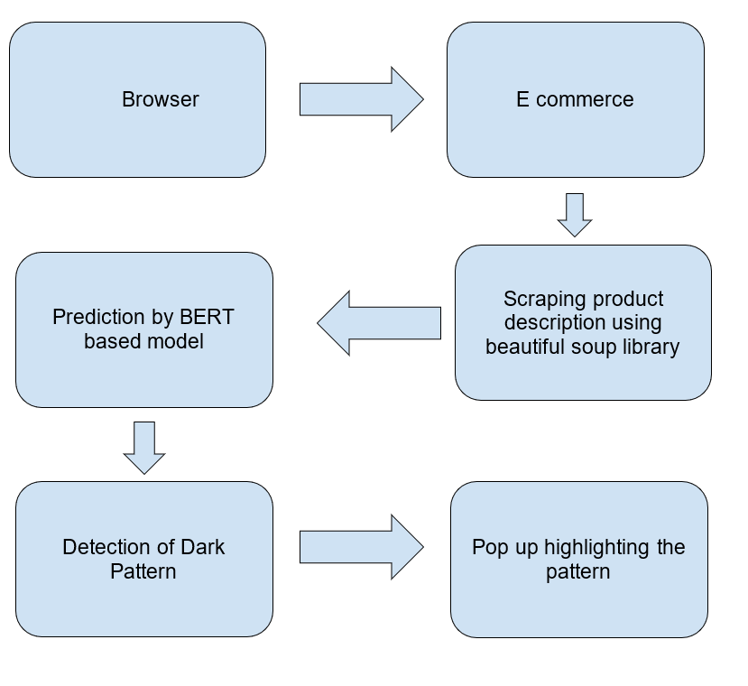

I. Introduction 

In today's world of e-commerce, Dark Patterns have become a frustrating challenge for users. These deceptive design tricks and manipulative prompts, while often subtle, create a maze that users find difficult to navigate. Beyond the annoyance, these practices also jeopardize user privacy, security, and trust.
Enter TrustForge and our solution—Om browser. Om is not just another browser; it's a dedicated response to the issue of dark patterns. With an integrated extension, Om is designed to spot and flag these deceptive practices seamlessly. We believe users deserve an online experience free from these hidden traps.
Om doesn't just rely on the basics. We've harnessed the power of BERT and NLP models to fine-tune its ability to detect and flag dark patterns effectively. This integration doesn't just make the browsing experience smoother; it also contributes to a safer online environment.
Security is a top priority for TrustForge. That's why Om goes the extra mile by incorporating encryption techniques. Your data deserves protection, and Om ensures that your privacy and confidentiality are safeguarded.
In a nutshell, TrustForge's project introduces Om—a browser that's more than a browser. It's your ally against dark patterns. With a focus on user-friendliness and a commitment to privacy and security, Om is here to redefine your online experience in the world of e-commerce.

II. Problem Synthesis
Dark patterns refer to deceptive design tactics in user interfaces, strategically crafted to influence users into making decisions that may not align with their best interests. These manipulative practices leverage psychological principles to subtly guide users towards unintended actions, often prioritizing the platform's interests over those of the user. They manifest in various forms, such as misleading prompts, concealed costs, and coercive language, and are pervasive across digital spaces like e-commerce and social media.
The adverse effects of dark patterns extend beyond mere inconvenience. They undermine user trust, jeopardize privacy, and compromise the overall integrity of online interactions. Exploiting cognitive biases and behavioral tendencies, these practices create an atmosphere where users may feel coerced or misled, negatively impacting their online experience and posing risks to their privacy and security.
The imperative for developing solutions to evade dark patterns stems from the critical need to foster a digital environment characterized by transparency, trust, and user-centric design. Users should be empowered to make informed choices without the shadow of manipulation. Implementing tools and strategies to detect and counteract dark patterns involves integrating user-friendly features, transparent disclosure mechanisms, and ethical design practices that prioritize the user's best interests.
Moreover, addressing dark patterns goes beyond ethical considerations; it is foundational to constructing a sustainable and trustworthy online ecosystem. As digital interactions become increasingly integral to our daily lives, the significance of cultivating a transparent and user-centric online space cannot be overstated. By championing solutions to counter dark patterns, we lay the groundwork for a more ethical, secure, and user-friendly digital realm that upholds the autonomy and well-being of users.

III. Problem Statement

The prevalence of deceptive design practices on e-commerce platforms is a concerning trend, as it often leads users into making choices or taking actions that may not align with their best interests. This not only raises issues of privacy and security but also erodes trust on the user's end. Recognizing the urgent need for a remedy, it becomes imperative to address these challenges.
The problem statement guides us towards innovating a software based solution for the detection of these dark patterns which plague the e-commerce industry. The expected solution should be adaptable, scalable, and have flexible implementation to account for futuristic technological advancements.  
Some of the dark patterns that we are expected to identify include misdirection, false urgency, scarcity and social proof. Solutions can be implemented by making extensions, websites, applications, browser that has inbuilt required functions, or any other software based solution. 

IV. Project Description

Our project: TrustForge, implements the solution to the problem statement using a browser which in itself holds the capability to detect dark patterns. It does so by using an inbuilt extension that has been integrated with ML models (BERT) trained to detect such patterns. Another branch of this solution is the way the browser ensures user privacy by encrypting user data (stored as cookies) so that any third party cannot access this user data and manipulate it to their use. 
It is noteworthy that in addition to this browser, we also provide an extension as an alternative solution. The browser holds advantage over the extension in terms of scalability and adaptability. The extension might not be compatible with all browsers, and to solve this, we may have to take away some key features of the solution. 
That is why instead of coming up with an extension, we have proposed a browser as a solution. 
Also, this ensures user friendly UI as well as easy accessibility to the solution. User experience is held at high priority, and the browser ensures trustworthy and convenient means to detect dark patterns. 

To summarize the project description, 

1.	Browser 
A  user-friendly browser, called Om, that has inbuilt dark patterns identification properties. It does so by using an inbuilt extension. The browser will detect these dark patterns and give a warning to the user about the same. 
2.	Built in extension
Om will have an inbuilt extension that detects and eliminates dark patterns on e-commerce websites. It has been integrated with ML models to detect these patterns. 
3.	ML models trained to detect dark patterns 
BERT and NLP models have been integrated with the extension for efficient dark pattern recognition. The models have been trained on relevant data set, and their accuracy, precision, and F1 scores are taken into account before making the decision to use the same. 
4.	Safeguarding user privacy 
Encryption techniques have been used to safeguard user data and maintain user privacy. User data usually gets stored as cookies on websites, and third party websites use these cookies to their use, by specific targeting users based on their prior interests, and browser history. TrustForge eliminates this entire cycle by encrypting the user data stores as cookies so that any third party cannot manipulate this data to their use. 
5.	Extension as an alternative solution 
We also provide an extension as an alternate solution. Yet the browser is a better solution in terms of scalability and adaptability, and also in terms of user experience. 

V. Research Objectives
1. User-Friendly Browser Development
Development of  a user-friendly web browser, named Om, with an integrated extension for streamlined user experience.
2. Dark Pattern Detection and Elimination
Implementation of  a robust dark pattern detection mechanism within the browser extension to identify and eliminate deceptive design practices on e-commerce websites.
3. Utilization of Advanced Technologies
Employment of cutting-edge technologies, including BERT and NLP models, to enhance the efficiency of pattern recognition and improve the browser's ability to analyze website interfaces.
4. Data Security Integration
Integration of encryption techniques within the browser to ensure the utmost security for user data, addressing concerns related to privacy and confidentiality.
5. Elimination of Manual Extension Installation
Addressing user inconvenience by eliminating the need for separate plugins, providing a hassle-free experience for users who would otherwise have to manually install extensions.
6. Comprehensive Browsing Solution
Position Om as a comprehensive browsing solution that not only focuses on ease of use but actively addresses the prevalent issue of dark patterns, contributing to a positive and trustworthy online environment.
7. Paradigm Shift in Online Navigation
Envision Om as a transformative tool that goes beyond being just a browser, aiming to redefine how users navigate the online space by actively countering dark patterns.
8. User Confidence and Trust
Fostering user confidence by creating a digital space where users can browse without fear of falling victim to deceptive tactics employed by certain websites.
9. Commitment to Transparency
Reflecting TrustForge's commitment to transparency, trust, and a positive user experience, contributing to a safer and more user-friendly internet landscape.
10. Holistic Approach to Security and Usability
Emphasis is on a holistic approach to both security and usability, ensuring that the browser not only protects user data but also provides a seamless and user-centric online experience.

VI. Scholarly Context
1.	Referenced Arunesh Mathur
2.	Referenced Arvind Narayan 
3.	Referenced Johanna Gunawan

VII. Methodology
A.	Overview of Methodology 
In this section, a comprehensive overview of the methodology is presented, shedding light on the intricacies of the process. The utilization of advanced technologies, specifically BERT and NLP models, is detailed, showcasing their pivotal role in enhancing the efficiency of the detection mechanism. Furthermore, encryption techniques are discussed, underscoring the commitment to securing user data within the browser. The deliberate design of the browser extension is expounded upon, providing insight into its integral role in facilitating the detection process seamlessly.

B.	Techniques and Tools

1.	Browser
The browser has been made on chromium framework. The built in extension has been integrated with the browser by forking chromium and joining the extension. 
2.	Extension
The extension has been made in JavaScript. The integration of the model within the extension has been done using Flask.
3.	ML models
We used BERT and NLP models, trained them on a relevant dark patterns data set, and deployed them to integrate in the extension. 
4.	Encryption Techniques
Made using JavaScript, this encryption is compatible with all browsers. The folder has to be uploaded and tapped into to enable it. 

 

IX. Conclusion

Our solution has a lot of scope for future scaling in terms of image sourced dark patterns, etc. 
All in all, we have provided a holistic solution, keeping in mind the convenience of the user, all while maintaining the integrity and precision of the solution. 

